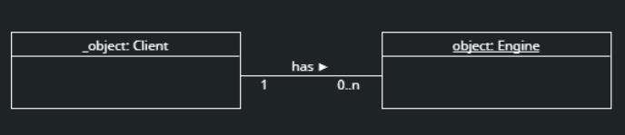

# Modo25 technical challenge

This is work for a technical challenge for a junior data engineer posititon with Modo25. Below are the specification as provided by the interviewers.

## Part 1
Design a SQL schema to represent the reporting data available from the [Awin Advertiser API](https://wiki.awin.com/index.php/Advertiser_API). The SQL schema should represent this data in a way that is easy to query and analyse. Provide your solution in DDL.

Provide a SQL query that will produce a summary report from this data.

## Part 2
Write a python class which represents a client of ASKBOSCO®.  The client class needs to represent the following information:

- Client Code (alphanumeric URL safe value that cannot start with a number or underscore)
- Client display name
- Dictionary of settings

The class must have methods to support pausing and enabling the client and checking its state as well methods and properties to model this relationship.

 
Additionally, clients may belong to one of several partner agencies and may be primarily lead generation or ecommerce based. Use your discretion in determining how to represent and model this information.

Provide tests for the class using PyTest.

## Part 3

Produce a high level design for a data pipeline using technologies and libraries that you are familiar with. How might you make an end to end system? Assume that data is being ingested from REST APIs

Explain why you chose the specific technologies for each component of the pipeline.

Consider scalability, reliability, and security.